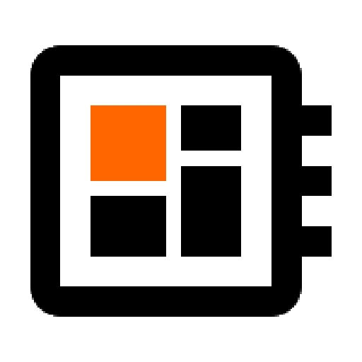

# Logos for projects and websites

Collect ideas for vector logos as AppIcon and webpage

## Logo for kreier.org

This one was created 2019:

   

## Logos for the Google Play Store

The design specifications can be found on the developer side for Android:

- [Google Play icon design specifications](https://developer.android.com/distribute/google-play/resources/icon-design-specifications)

The regular icon will be 512x512 32-bit PNG in sRGB. For my two apps I created them:

### Beschleunigungssensor

Developed in December 2015 and finally applying for my first app I also used a free material icon, changes some colors and created this app icon:

### Wificar23

This project from 2024 let's a robot car controlled by a esp8266 be directed with a smartphone giving the instructions.

## Logo for saiht.de

Since 1999 several icons and logos have been used:

     

## Wificar24

It was planned to finally have a working app in the Google Playstore. Yet time was not sufficient, too many projects. Here my logo idea:

